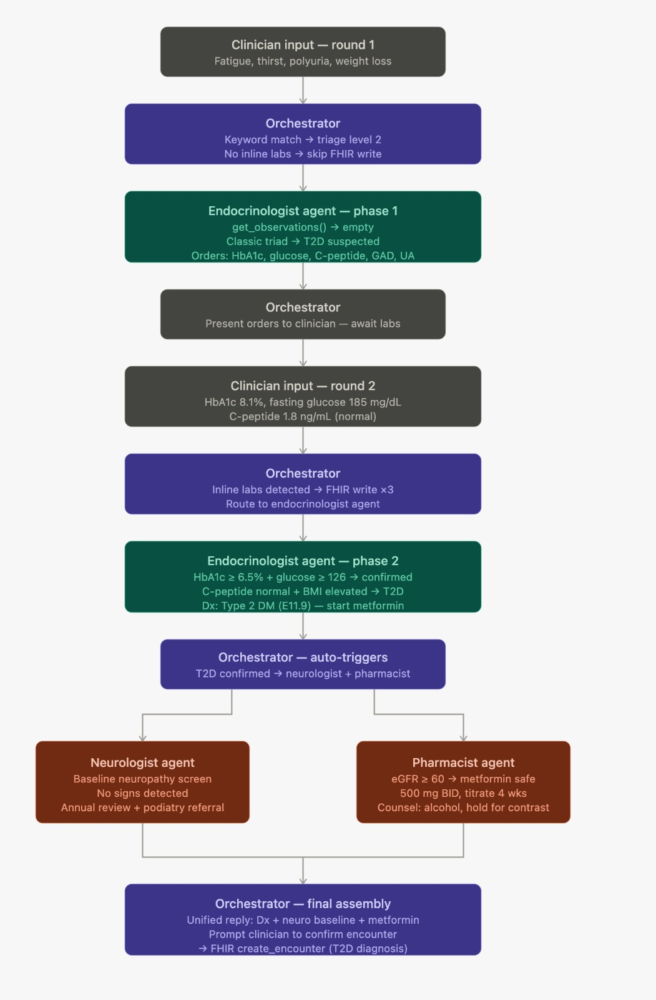

# ClinIQ — AI-Powered Clinical Decision Support
### Agents Assemble Hackathon · Track: Agent (A2A) · Platform: Prompt Opinion

---

## What is ClinIQ?

ClinIQ is a multi-agent clinical decision support system that guides a doctor from a patient's first symptom presentation through to a confirmed diagnosis and treatment plan — using real FHIR R4 patient data at every step.

A team of six specialist AI agents, each equipped with a clinical rule book, collaborate through a central orchestrator to read the patient's full health record, reason across it, and surface actionable clinical insights in seconds. Every finding is grounded in live FHIR data — not LLM guessing.

---

## Architecture



**Key principle:** All specialist agents run in-process via ADK `AgentTool`. FHIR credentials travel in A2A message metadata — they never appear in the LLM prompt.

---

## End-to-End Clinical Flow

The diagram below traces a real two-round consultation — from a clinician describing symptoms, through specialist routing, lab posting, diagnosis, and final FHIR write-back.



**What the diagram shows:**

| Step | Actor | What happens |
|---|---|---|
| Round 1 input | Clinician | Fatigue, thirst, polyuria, weight loss — no lab values yet |
| Triage | Orchestrator | Keyword match → Level 2; no inline labs → skip FHIR write |
| Phase 1 | Endocrinologist | `get_observations()` returns empty; classic triad → T2D suspected; orders HbA1c, glucose, C-peptide, GAD, UA |
| Await labs | Orchestrator | Presents orders to clinician |
| Round 2 input | Clinician | HbA1c 8.1%, fasting glucose 185 mg/dL, C-peptide 1.8 ng/mL |
| FHIR write | Orchestrator | Inline labs detected → `create_observation` ×3 before routing |
| Phase 2 | Endocrinologist | HbA1c ≥ 6.5% + glucose ≥ 126 confirmed; C-peptide normal + BMI elevated → **Type 2 DM (E11.9)** — start Metformin |
| Auto-trigger | Orchestrator | T2D confirmed → simultaneously routes to neurologist + pharmacist |
| Neuro screen | Neurologist | Baseline neuropathy screen; no signs detected; annual review + podiatry referral |
| Med safety | Pharmacist | eGFR ≥ 60 → Metformin safe; 500 mg BID, titrate 4 weeks; counsel on alcohol and hold for contrast |
| Final assembly | Orchestrator | Unified reply: diagnosis + neuro baseline + Metformin plan; prompts clinician to confirm encounter → `create_encounter` |

---

## Agents

### Orchestrator
The only agent the chatbot talks to. It implements a three-level triage protocol:

| Level | Trigger | Action |
|---|---|---|
| 1 — Simple lookup | Data request (demographics, chart brief) | Routes to `healthcare_fhir_agent` only |
| 2 — Clinical finding | Symptoms, labs, or clinical question | Routes to `healthcare_fhir_agent` + one specialist |
| 3 — Multi-system | Multiple specialties requested | Routes to `healthcare_fhir_agent` + multiple specialists in sequence |

**Routing is keyword-driven and explicit** — the orchestrator never answers clinical questions from its own knowledge. It:
- Detects explicit write requests (encounter, medication, condition) and routes them directly without triggering specialist agents
- Auto-triggers `pharmacist_agent` whenever a new treatment is being discussed
- Offers to record the encounter once a diagnosis is confirmed

---

### healthcare_fhir_agent
Pure FHIR data layer — all reads and writes. No clinical reasoning.

**Read tools:**
| Tool | FHIR Resource | Returns |
|---|---|---|
| `get_patient_demographics` | `Patient` | Name, DOB, gender, contacts, address |
| `get_active_medications` | `MedicationStatement` | Active medications, dosage, prescriber |
| `get_active_conditions` | `Condition` | Active diagnoses, severity, onset date |
| `get_observations` | `Observation` | Vitals and lab results by category |
| `get_encounters` | `Encounter` | Visit history, reason, practitioner, dates |

**Write tools:**
| Tool | FHIR Resource | Creates |
|---|---|---|
| `create_observation` | `Observation` | Lab result with LOINC code, value, and unit |
| `create_encounter` | `Encounter` | Visit record with reason and practitioner |
| `create_medication` | `MedicationStatement` | Active medication with dosage instructions |
| `create_condition` | `Condition` | Confirmed clinical condition with ICD-10 code |

---

### endocrinologist_agent
Interprets metabolic and hormonal lab results using a rule book.

**Clinical rule book:**
- **HbA1c thresholds:** Normal (<5.7%) → Prediabetes (5.7–6.4%) → Diabetes (≥6.5%) → Poor control (≥9.0%)
- **Fasting glucose:** Normal (<100) → Prediabetes (100–125) → Diabetes (≥126) → DKA risk (>400)
- **Type 1 vs Type 2 differentiation:**
  - C-peptide low + GAD antibody positive → Type 1 DM → initiate insulin
  - C-peptide low + GAD antibody negative → Consider MODY → genetics referral
  - C-peptide normal/high + GAD antibody negative → Type 2 DM → Metformin first-line
- **Thyroid:** TSH thresholds for hypo/hyperthyroidism
- **DKA red flags:** Glucose >400, ketones present, HHS indicators

**Tools:** `get_observations`, `get_active_conditions`, `get_patient_demographics`

---

### cardiologist_agent
Evaluates cardiovascular risk from vitals and lipid panels.

**Clinical rule book:**
- **Blood pressure (adult):** Normal → Elevated → Stage 1 HTN (130–139/80–89) → Stage 2 HTN (≥140/90) → Hypertensive crisis (≥180/120)
- **Blood pressure (pediatric):** Age/sex/height-adjusted percentile classification
- **Heart rate:** Tachycardia (>100 adult), bradycardia (<60), arrhythmia indicators
- **Lipid panel:** LDL thresholds (optimal <100, statin indicated ≥160), HDL risk assessment, triglycerides
- **Cardiovascular risk scoring:** New diabetes → automatic risk elevation; diabetes + HTN → high risk; statin consideration with dyslipidemia

**Red flags:** BP ≥ 180/120, HR >150 or <40, chest pain + elevated HR, elevated troponin

**Tools:** `get_observations`, `get_active_conditions`, `get_patient_demographics`

---

### neurologist_agent
Screens for peripheral neuropathy, autonomic dysfunction, and cognitive impairment.

**Clinical rule book:**
- **Peripheral neuropathy:** Symptom-triggered screen (numbness, tingling, burning, weakness); diabetes diagnosis always triggers baseline screen
- **Autonomic neuropathy:** Resting tachycardia, orthostatic hypotension, gastroparesis + diabetes
- **Cognitive assessment:** MMSE/MoCA thresholds, rapid decline workup, dementia screening (age >65)
- **Imaging interpretation:** White matter hyperintensities, cerebral atrophy, EMG conduction velocity, acute focal lesions
- **Headache classification:** Tension-type, migraine, thunderclap (subarachnoid hemorrhage protocol)
- **Diabetes screening schedule:** Baseline at diagnosis; annually from year 5 (T1D) and year 1 (T2D)

**Red flags:** Sudden focal deficit (stroke protocol), thunderclap headache, new-onset seizure, meningism

**Tools:** `get_observations`, `get_active_conditions`, `get_patient_demographics`, `get_encounters`

---

### pharmacist_agent
Reviews medication safety before any new treatment is started.

**Clinical rule book:**
- **Drug-drug interactions (flagged explicitly):**
  - Metformin + Topiramate → carbonic anhydrase inhibition → lactic acidosis risk (HIGH) → recommend Propranolol as alternative
  - Metformin + IV contrast → hold 48h pre/post imaging
  - Insulin + beta-blockers → masked hypoglycemia
  - Insulin + corticosteroids → glucose elevation, dose adjustment
  - SSRIs + triptans → serotonin syndrome
  - Warfarin + NSAIDs/antibiotics → INR fluctuation
- **Renal dosing:** eGFR <60 → dose review; eGFR <30 → Metformin contraindicated; eGFR <15 → insulin only
- **Hepatic dosing:** ALT/AST >3× ULN → hepatic drug review; severe impairment → Metformin contraindicated
- **Contraindications:** Metformin + heart failure (EF <35%), thiazolidinediones + heart failure, NSAIDs + CKD
- **Pediatric flags:** Weight-based dosing verification; adult doses in patients <18 flagged for review

**Output always includes:** interaction severity (high/medium/low), contraindication flags, dosage assessment, safe-to-proceed / substitute recommendation

**Tools:** `get_active_medications`, `get_active_conditions`, `get_patient_demographics`, `get_observations`

---

### general_agent
Stateless utility agent — no FHIR, no clinical reasoning.

**Tools:**
- `get_current_datetime(timezone)` — current date/time in any IANA timezone
- `look_up_icd10(term)` — ICD-10-CM code lookup from built-in reference table

---

## FHIR Write Tools — LOINC Reference

| Lab | LOINC Code |
|---|---|
| HbA1c | 4548-4 |
| Fasting glucose | 1558-6 |
| C-peptide | 1986-9 |
| GAD antibody | 56695-0 |
| LDL | 2089-1 |
| HDL | 2085-9 |
| Triglycerides | 2571-8 |
| Creatinine | 2160-0 |
| Potassium | 2823-3 |
| TSH | 3016-3 |
| BNP | 42637-9 |
| Troponin | 6598-7 |
| eGFR | 62238-1 |
| Hemoglobin | 718-7 |

---

## Key Design Decisions

### 1. Specialist Rule Books — not LLM guessing
Every clinical decision traces back to a numbered rule in the agent's instruction. Thresholds are explicit and deterministic. The LLM reasons within the rule book, not around it.

### 2. Bidirectional FHIR
ClinIQ reads patient history AND writes back: lab results (`create_observation`), visits (`create_encounter`), prescriptions (`create_medication`), and diagnoses (`create_condition`) — all persisted to the FHIR server during the conversation.

### 3. HIPAA by design
HIPAA guardrails are injected into every agent's instruction from `shared/hipaa.py`. FHIR credentials travel in A2A metadata, extracted by `before_model_callback` into session state — they never appear in any prompt. Every clinical output carries an AI-generated decision support disclaimer.

### 4. Zero-latency specialist consultation
All agents run in-process via ADK `AgentTool`. There are no inter-agent HTTP calls — the orchestrator calls specialists the way a function calls another function.

### 5. Multi-turn conversation fix
Prompt Opinion reuses task IDs across turns. Fixed in `shared/middleware.py`: strips `taskId` from `message/send` params so each turn creates a fresh A2A task while preserving `contextId` for FHIR session continuity.

### 6. Explicit triage routing — STEP 0 write guard
The orchestrator decision tree includes a STEP 0 that intercepts explicit write commands ("record this visit", "create encounter", "prescribe", "add condition") before symptom keywords trigger specialist routing — preventing write requests from being accidentally routed to clinical agents.

---

## Technical Stack

| Component | Technology |
|---|---|
| Agent framework | Google ADK |
| Agent protocol | A2A v1 |
| LLM | Gemini 2.5 Flash via LiteLLM (swappable to GPT-4o, Claude, Vertex AI) |
| Platform | Prompt Opinion |
| Health data | FHIR R4 |
| Transport | ASGI / uvicorn |
| Deployment | Docker Compose + ngrok |

---

## Project Structure

```
po-adk-python/
├── orchestrator/               # Triage + routing agent (single entry point)
├── healthcare_agent/           # All FHIR reads and writes
├── endocrinologist_agent/      # Metabolic / hormonal rule book
├── cardiologist_agent/         # Cardiovascular rule book
├── neurologist_agent/          # Neurological rule book
├── pharmacist_agent/           # Medication safety rule book
├── general_agent/              # Date/time, ICD-10 lookups
└── shared/
    ├── tools/fhir.py           # All 9 FHIR read/write tools + LOINC table
    ├── hipaa.py                # HIPAA guardrails injected into every agent
    ├── fhir_hook.py            # FHIR credential extraction (before_model_callback)
    ├── middleware.py           # API key auth + PO compatibility + task ID fix
    └── app_factory.py          # A2A agent card factory (A2A v1 compliant)
```

---

## Conversation Starters

These are ready-to-use opening prompts that exercise different triage levels and specialist routes.

### Patient Overview
> "@orchestrator Give me a quick chart brief for this patient."

> "@orchestrator What medications is this patient currently on?"

> "@orchestrator What active conditions does this patient have on record?"

> "@orchestrator When was this patient's last visit and what was it for?"

---

### Endocrinology
> "@orchestrator Patient has HbA1c 9.2% and fasting glucose 280 mg/dL. What's the clinical picture?"

> "@orchestrator Patient presents with fatigue, excessive thirst, and unexplained weight loss over 3 weeks. Where do we start?"

> "@orchestrator Labs show C-peptide 0.3 ng/mL and GAD antibody positive. What does that tell us?"

> "@orchestrator TSH came back at 6.8. What's the interpretation and next step?"

---

### Cardiology
> "@orchestrator BP reading today is 158/96. How do we classify this and what's recommended?"

> "@orchestrator Lipid panel: LDL 188, HDL 38, triglycerides 210. Assess cardiovascular risk."

> "@orchestrator Patient has a resting heart rate of 112 bpm with no prior cardiac history. Thoughts?"

> "@orchestrator New diabetes diagnosis confirmed — what's the cardiovascular risk implication?"

---

### Neurology
> "@orchestrator Patient reports numbness and burning in both feet for the past month. Diabetes was diagnosed last year. What's the workup?"

> "@orchestrator Patient is complaining of memory lapses and confusion. Age 67. What should we investigate?"

> "@orchestrator Sudden onset headache described as the worst of their life. What's the protocol?"

---

### Pharmacology / Medication Safety
> "@orchestrator We're planning to start Metformin. Patient is currently on Topiramate. Is that safe?"

> "@orchestrator What are the drug interactions to watch for if we add insulin to this patient's current regimen?"

> "@orchestrator Patient's eGFR is 28. Can we still use Metformin?"

---

### Multi-System (Highest Complexity)
> "@orchestrator Patient has HbA1c 9.2%, BP 148/92, tingling in feet, and we're considering starting Metformin. Full assessment please."

> "@orchestrator New diagnosis: Type 2 diabetes with elevated LDL and a history of hypertension. Walk me through everything — cardiac risk, neuro baseline, and medication safety."

---

### Write Actions
> "@orchestrator Record this visit. Practitioner: Dr. Patel. Reason: Type 2 diabetes initial consultation."

> "@orchestrator Post the HbA1c result: 9.2%."

> "@orchestrator Add Metformin 500mg twice daily to the patient's medication list."

> "@orchestrator Create a condition entry for Type 2 Diabetes Mellitus."

---

## Sample Conversations

### Conversation 1 — Diabetes Workup (Multi-System, Level 3)

**Doctor:** @orchestrator Patient has HbA1c 9.2%, fasting glucose 280, fatigue, polydipsia, and tingling in both feet. What's going on?

**ClinIQ:** I called the endocrinologist and neurologist agents, fetched the patient's FHIR record, and then auto-triggered a pharmacist safety check since a treatment recommendation is coming.

**Endocrinology findings:**
- HbA1c 9.2% → Diabetes confirmed, poor control (≥9.0% threshold)
- Fasting glucose 280 mg/dL → Diabetes range; no DKA risk yet (below 400 threshold)
- C-peptide from record: 0.8 ng/mL (normal); GAD antibody: negative
- Rule: C-peptide normal + GAD antibody negative → **Type 2 Diabetes Mellitus**
- Recommendation: Metformin first-line; lifestyle intervention; recheck HbA1c in 3 months

**Neurology findings:**
- Confirmed diabetes triggers mandatory baseline neuropathy screen
- Tingling in both feet → consistent with early peripheral neuropathy
- Recommendation: Annual neuropathy screening from Year 1 (T2D protocol); consider nerve conduction study if symptoms worsen

**Pharmacist safety check (Metformin):**
- No Topiramate or IV contrast on record — no lactic acidosis risk
- eGFR 74 → Metformin safe at standard dose (contraindicated below 30)
- No active heart failure on record → no contraindication
- **Safe to proceed with Metformin 500mg twice daily**

**Red flags:** None at this time. Monitor for glucose >400, ketones, or altered mental status.

A diagnosis of Type 2 Diabetes Mellitus with early peripheral neuropathy has been reached. Would you like me to record this visit? If so, please confirm your name and the visit reason.

⚠️ AI-generated decision support only. A licensed clinician must review and confirm before taking any clinical action.

---

**Doctor:** @orchestrator Yes, record it. Practitioner is Dr. Patel, reason is Type 2 diabetes initial consultation.

**ClinIQ:** Done. I've written the following to the FHIR record:
- **Encounter** — Visit with Dr. Patel, reason: Type 2 diabetes initial consultation
- **Condition** — Type 2 Diabetes Mellitus (ICD-10: E11)
- **Observation** — HbA1c 9.2% (LOINC: 4548-4)
- **Medication** — Metformin 500mg twice daily

All records are now live in the patient's FHIR chart.

---

### Conversation 2 — Medication Safety Check (Level 2)

**Doctor:** @orchestrator We're thinking of starting Metformin for this patient. They're currently on Topiramate for migraines. Safe to proceed?

**ClinIQ:** I called the pharmacist agent with the current medication list and proposed treatment.

**Pharmacist findings:**
- **Metformin + Topiramate — HIGH RISK interaction**
- Both drugs inhibit carbonic anhydrase. Co-administration increases the risk of metabolic acidosis (lactic acidosis)
- This combination is flagged as high severity
- **Recommendation:** Do not start Metformin while Topiramate is active. Consider Propranolol as an alternative for migraine prophylaxis, then reassess Metformin safety.

**Next step:** If Topiramate cannot be discontinued, discuss alternative diabetes medications (e.g. SGLT-2 inhibitor or GLP-1 agonist) that do not carry this interaction risk.

⚠️ AI-generated decision support only. A licensed clinician must review and confirm before taking any clinical action.

---

**Doctor:** @orchestrator What if we switch the migraine medication to Propranolol — then can we use Metformin?

**ClinIQ:** I re-ran the pharmacist check with Propranolol in place of Topiramate.

**Pharmacist findings:**
- **Propranolol + Metformin** — No direct contraindication
- Note: Propranolol (beta-blocker) can mask hypoglycemia symptoms — relevant if insulin is added later
- eGFR from record: 74 → Metformin safe at standard dose
- No heart failure on record → no contraindication
- **Safe to proceed with Metformin once Topiramate is discontinued**

Would you like me to update the medication list — remove Topiramate, add Propranolol, and add Metformin?

---

### Conversation 3 — Cardiovascular Risk with New Diabetes Diagnosis (Level 2)

**Doctor:** @orchestrator We just confirmed Type 2 diabetes. What's the cardiovascular risk picture for this patient?

**ClinIQ:** I called the cardiologist agent with the confirmed diabetes diagnosis and pulled the latest vitals and lipid panel from the FHIR record.

**Cardiology findings:**
- **Blood pressure:** 138/88 mmHg → Stage 1 Hypertension (130–139/80–89 range)
- **Heart rate:** 78 bpm → Normal
- **Lipid panel:**
  - LDL: 162 mg/dL → Above optimal (≥160 threshold); statin consideration indicated
  - HDL: 42 mg/dL → Below optimal (risk factor)
  - Triglycerides: 195 mg/dL → Borderline high
- **New diabetes diagnosis** → Automatic cardiovascular risk elevation per rule book
- **Diabetes + Stage 1 HTN** → High cardiovascular risk profile

**Red flags:** None acute. No chest pain, troponin, or BNP in record.

**Recommendations:**
1. Initiate statin therapy (LDL ≥160 + diabetes = statin indicated)
2. Antihypertensive evaluation — Stage 1 HTN with diabetes warrants treatment
3. Lifestyle intervention: diet, exercise, smoking cessation assessment

Shall I also check medication safety before you start a statin?

---

### Conversation 4 — Simple Data Lookup (Level 1)

**Doctor:** @orchestrator Quick chart brief — what do we know about this patient?

**ClinIQ:** I called the healthcare FHIR agent to retrieve the patient summary.

**Patient summary:**
- **Demographics:** Sarah Mitchell, 52F, DOB 14 Mar 1972
- **Active conditions:** Type 2 Diabetes Mellitus (diagnosed 2022), Essential Hypertension (diagnosed 2019)
- **Active medications:** Lisinopril 10mg once daily, Atorvastatin 20mg once nightly
- **Recent observations:** HbA1c 8.1% (3 months ago), BP 142/88 (last visit), eGFR 68
- **Last encounter:** 12 Feb 2026 — Diabetes follow-up with Dr. Chen

Would you like me to dig into any specific area — labs, medication safety, or a specialist assessment?

---

*⚠️ AI-generated decision support only. A licensed clinician must review and confirm before taking any clinical action.*
